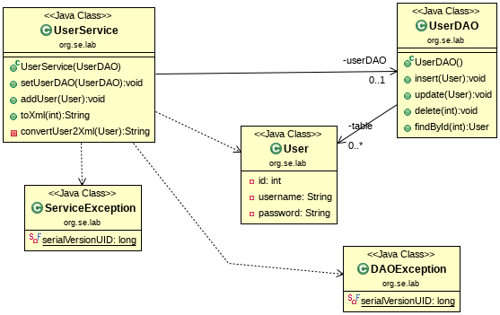

## Example: JUnit4-TestDouble-MockObject-Class

This example shows how a mocking framework can be used to implement a test 
stub or a test spy **without having an interface**.
It can be seen from the class diagram that no extra helper classes (stub or spy) 
or interfaces are need to be implemented for testing.

A **Stub** only uses the type information and overwrites the methods of a referenced
class.

A **Spy** routes the method calls to the real object and records these interactions. 

## References

* Sujoy Acharya. **Mockito Essentials**. Packt Publishing, 2014 
* [Mockito Web Page](https://site.mockito.org/)

*Egon Teiniker, 2018, GPL v3.0*