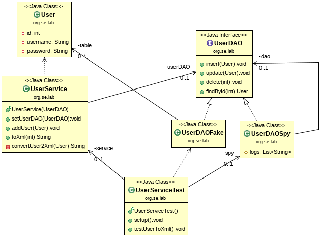

## Example: JUnit4-TestDouble-Spy

This example shows how a **Fake Object** and a **Test Spy** together can be 
used to simulate database access and to record indirect outputs of a SUT.



The class *UserService* should be tested (SUT). 
To simulate database access, the class *UserDAOFake* is used. 
The *User* objects are managed in a in-memory list.

The SUT, the fake object and the test spy are instantiated and linked 
together. In addition, two users are added to the in-memory list via the 
SUT.

```java
    @Before
    public void setup()
    {
        UserDAO dao = new UserDAOFake();
        spy = new UserDAOSpy(dao);
        service = new UserService(spy);

        service.addUser(new User(3,"marge", "tLgR+kBQUymuhx5S8DUnw3IMmvf7hgeBllhTXFSExB4="));
        service.addUser(new User(7,"homer", "Kqq3lbODaQT4LvxsoihdknrtdSBiFOHaODQY65DJBS8="));
    }    
```

While the fake object makes the SUT work, the Spy test records every 
interaction between the SUT and the *UserDAO* interface:

```java
    @Test
    public void testUserToXml()
    {
    	// exercise
        String xml = service.toXml(7);
        
        // verify
        String expected =
                "<user>" +
                    "<id>7</id>" +
                    "<name>homer</name>" +
                    "<password>Kqq3lbODaQT4LvxsoihdknrtdSBiFOHaODQY65DJBS8=</password>" +
                "</user>";
        Assert.assertEquals(expected, xml);

        spy.logs.forEach(System.out::println);
        Assert.assertEquals(2, spy.logs.stream().filter((line)->line.startsWith("insert")).count());
        Assert.assertEquals(1, spy.logs.stream().filter((line)->line.startsWith("findById")).count());
    }
```
For verification, the entries in the spy log list can be evaluated. 
It can be checked which method was called, how often and with which parameters.


*Egon Teiniker, 2018, GPL v3.0*